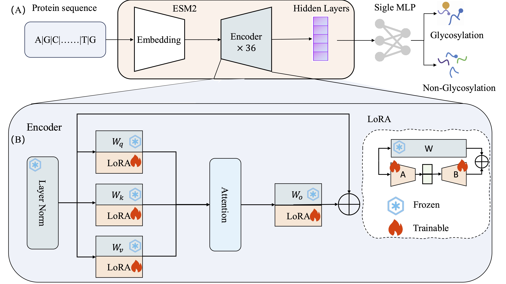

# ESM-LoRA-Gly: Improved prediction of N and O-linked glycosylation sites by tuning protein language models with low-rank adaptation (LoRA)

**Zhiyong Feng** <sup>1,2</sup>, Xing Zhang<sup>2</sup>, He Wang<sup>2</sup>, Xu Hong<sup>2</sup>, Jian Zhan<sup>2,3</sup>, and Yaoqi Zhou<sup>2</sup>


## Introduction



**Figure 1:** (A) The overall architecture of our model: Generating embedding from ESM-2 with an input of query protein sequence, followed by utilizing the Low-rank adapters (LoRA) encoder to train an MLP for prediction of glycosylation sites. (B) The detailed architecture for training the LoRA encoder, $W_q$, $W_k$, $W_v$ are the parameters of the ESM2 encoder attention layer query, key, and value, and $W_o$ is the output layer of the encoder. LoRA refines $W_q$, $W_k$, $W_v$ by decomposing the changes $\Delta W$ as the multiplication product of two matrices $A$ and $B$ of lower rank $r(\Delta W = AB)$ and minimizing $A$ and $B$ with fewer parameters.

## Environments
```bash
git clone https://github.com/NancyFyong/ESM-LoRA-Gly.git
conda env create -f env.yml
```

## Datasets

- the N-GlycositeAltas dataset and O-linked dataset under folder `data/`:
    ```
    ├── data
    │   ├── N-GlycositeAltas
    │   │     ├── train.csv
    │   │     ├── test.csv
    │   │     └── valid.csv
    │   ├── O-linked
    │   │     ├── train.csv
    │   │     ├── test.csv
    │   │     └── valid.csv
    ```

## Usage

### Quick predict glycosylation sites of N-GlycositeAltas dataset and O-linked dataset:
put checkpoints under folder `checkpoints/`:

    ├── checkpoints
    │       └── N-linked
    │             └──ESM-3B
    |             └──ESM-150M
    │       └── O-linked
    │             └──ESM-3B
    ├── data
    ├── model
    ├── scripts
    ├── main.py
    ├── predict.py


### Train the classifier of ESM-LoRA-Gly on N-GlycositeAltas dataset:
```
bash scripts/train.sh
```

### eval  N-linked glycosylation sites of N-GlycositeAltas dataset（sigle site）:
```
bash scritps/test.sh
```

### predict  N-linked glycosylation sites(sigle protein):
```
python inference.py
```

